# Pre-Internship IoT Automation Project — BEIA Consult International

This repository documents a pre-internship project developed for **BEIA Consult International**, focused on IoT, data transmission, blockchain storage, service orchestration, and data visualization.

## Project Objectives

- the integration of an IoT device with MQTT communication;
- local and cloud storage;
- blockchain security;
- orchestration of Arrowhead services using Docker;
- data visualization using Grafana;
- data processing using Node-Red;
- Waspmote configuration;
 

---

## Technologies & Tools Used

- **Python** – Data simulation & MQTT publishing;  
- **Libelium** – Real sensor data acquisition;  
- **MQTT** – Lightweight communication protocol; 
- **Node-RED** – Data processing & routing;  
- **InfluxDB** – Time-series database;  
- **Grafana** – Alerts & visualization;  
- **Ethereum Blockchain** – Secure data storage;  
- **Telegram Bot** – Data query interface;  
- **Docker** – Containerized service orchestration with Arrowhead;  

---

## IoT Data Simulation
- Used **Python Script** (**mqtt_random.py**) to simulate the communication;
- Imported all the **libraries** for MQTT, JSON;
- Generated data for **temperature, humidity, solar radiation and precipitation** with a random function. Generated the timestamp using the .strftime() function;
  
---

## Node-Red Data Processing
- **Node-Red** is used to take the data from the **MQTT Broker**, process it, save it locally and send it to an InfluxDB Data Base;


- The **MQTT IN** Node gets the data from the Broker using the server and the topic;
- Used 2 **Debug Nodes** to check the data before and after applying a JSON Node;
- The **MQTT OUT** Node sends the data further to Grafana;

---

## Grafana - Data Visualization
- Created a new **Grafana dashboard**;
- Imported the **topic**(in this picture, it’s the temperature parameter, generated with the random values);


---

## Libelium for Data Gathering
- Replaced the random values generated in the Python script with actual data from a **Libelium station**;
- The station, equipped with **sensors**, gathers data and sends it to the **MQTT Broker**;

---

### 1. Wi-Fi configuration for Libelium


- Connected to **WaspMote**, selected the right Port and implemented a Wi-Fi configuration code (**waspmote_wifi.ino**);
- Now, the **Wi-Fi** is **configured** on the station;
  
### 2. Data Gathering
- Uploaded a Data Gathering code (**waspmote_data_gathering.ino**), that declares each sensor by its socket;
- Named the **Moat ID** as: **“Darius-Libelium”**. This is used to create the **topic**;
- The data is collected from the station with **.get() functions**;
- Printed text for user-friendly approach;
- Created a **frame** that will be sent further to the **Broker**;

### 3. Node-Red Data Processing


- The data from WaspMote gets to the MQTT IN Node with the name: **meshlium3d4c/Darius-Libelium/#**, where: **meshlium3d4c** is the name of the meshlium, **Darius-Libelium** is the name of the topic, and **#** is used so the data from all the sensors is transmitted.
- The data goes through a **JSON Node**, and then it does into the MQTT OUT Node with the topic **training/device/darius-vasile**;

### 4. Grafana Data Visualization


- Displayed the **Battery Status** and the **Temperature** in a Dashboard;
  


- Displayed the **Pressure** as a **Gauge**;

### 5. Grafana Alerts


- Set 2 **alerts** for the temperature. An alert will be sent on my personal email if the temperature is **above 25** or **above 29**;


- Received the **alert** on the email;

---

### 6. Node-Red for Data Processing


- Added a **Function Node** into the architecture, that converts the Temperature from **Celsius to Kelvin**;
- Checked the result with a **Debug Node**;

---

## ChatBot for Data Interrogation
- Created a **ChatBot** using **Telegram**, to get the values generated at random by the **Python Script** (**mqtt_random.py**);
- Implemented a Python Script (**darius_bot.py**) that gahters the data and sends it in **Telegram**;
- **get_latest_data()** extracts the latest data from the JSON file;
- The **start()** function displays every command available on the ChatBot;
- The **humidity()**, **temperature()**, **radiation()**, **precipitation()** functions show the parameters in the ChatBot;
- The **all_data()** function displays all the parameters extracted;


- Also, created an alert, that sends a message if the temperature is **over 30**;
  


---

For the next step, the random data generator script has been replaced with **real sensor data** from a **Libelium station**.

- Generated a **Python Script** (**mqtt_waspmote.py**), that gets the data from the **Libelium station**, using the **Broker** and the **Topic**, and creates a **JSON file**, ready to be sent in **Telegram**;
  
- Created the architecture in **Node-Red**, in order to create the **JSON file**.

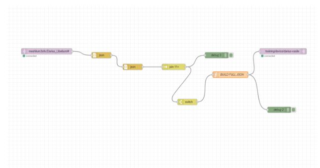
  
  * The 2 **JSON Nodes** are used to convert the MQTT string **payload** into a **JSON Object**. There are 2, because sometimes the string is **double-encoded**;
    
  * The Join Node collects all of the 11 individual sensor messages(generated from TC, BAT, PM, etc.) and combines them into a single message;
    
  * The **switch Node** is to control when the **BUILD FULL JSON** function should run, only after receiving a specific signal that indicates all sensor data has arrived( in this case, the **battery parameter**);
    
  * The **function Node** extracts each sensor from the joined array and builds one **JSON object** containing **all values**, timestamp, and source;
    
- The code is functional and messages are **received**. The JSON File is ready to be sent, using **darius_bot.py**;

---

## Blockchain for Data Storage

- Used **Blockchain** to store the data gathered from the sensors;

Technologies used:
* **Python** (programming logic)
* **Alchemy** (blockchain node provider)
* **Ethereum Sepolia Testnet** (for storing transactions. Ethereum is used for the Chains, Sepolia is used for the Network)
* **MetaMask** (Ethereum wallet)
* **MQTT** (for data simulation and transmission)
* **JSON** (for data format)

- Used the **mqtt_random.py** File to generate Random Values for the parameters every **10 minutes**(because, if the rate is higher, the blockchain is not able to process the quick changes);
  
- Created a **MetaMask Wallet**. The Wallet acts as a blockchain identity (Wallet ID) and a signer for transactions (Private Key);
  
- Funded the **Wallet** (on the Sepolia Testnet) using a **faucet** – a free service that gives test ETH to developers. This is necessary, because of the **gas fees** on the blockchain.

  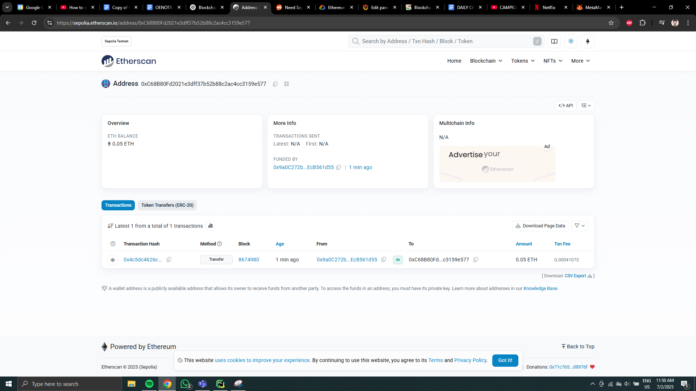
  
- Created an **Ethereum RPC Endpoint** using **Alchemy**. Alchemy provides a high-reliability API endpoint to connect to the blockchain, **without running** an **Ethereum Node**.
  
- Generated a Python Code (**send_to_blockchain.py**), that connects to the **Sepolia blockchain** using the Alchemy RPC URL, reads IoT data from a **JSON file**, signs the data with the **wallet’s private key**, and sends it as a **transaction** to be permanently stored on the blockchain.
  
- Received **confirmation steps**, and an Etherscan link that shows the **full transaction details**;

  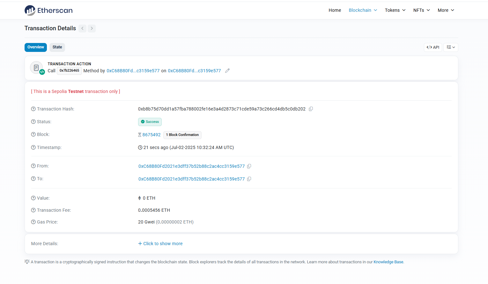
  
- Now, the **transaction** is **visible**, and the data is **stored** in the **Blockchain**;

--- 

## Arrowhead Orchestration with Docker

Technologies Used:
* **Docker** - to run isolated services in containers;
* **Arrowhead** - to register services and ensure communication between them;
* **Python Script** - for random data generation;

Steps of Implementation:

* Created 3 separate services, each running in its **own Docker container**:

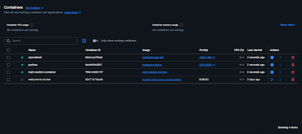

* **mqtt-random-container** - Docker container with a Python script that generates random IoT data and publishes this data to the MQTT topic: **training/device/darius-vasile/data-in.**

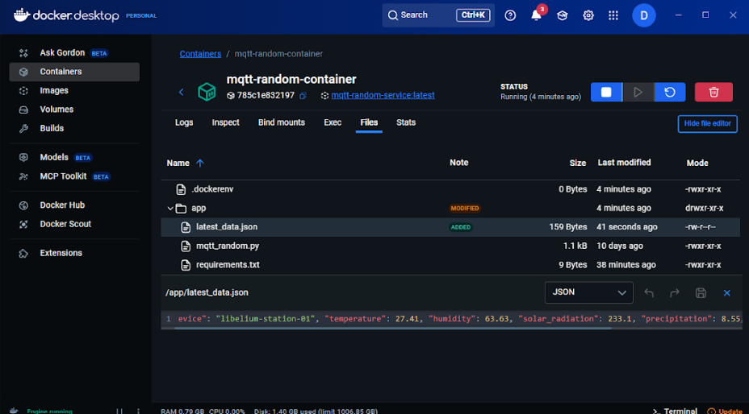


* **mynodered** - Docker container that listens to messages on the **MQTT topic** and **sends the processed** data into **Grafana**.

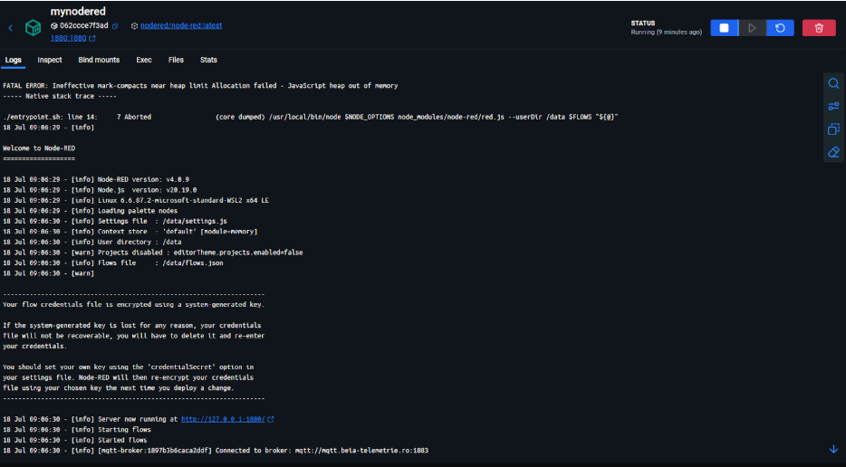

* This is the **Node-Red Architecture**, so the data can be sent to Grafana:

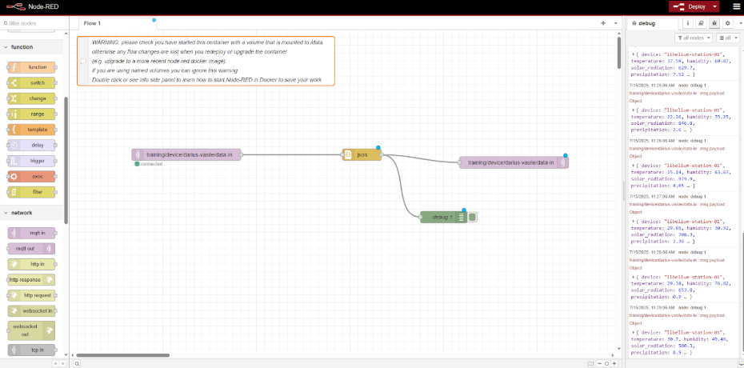

* **Grafana** - visualizes the data received via **MQTT**.

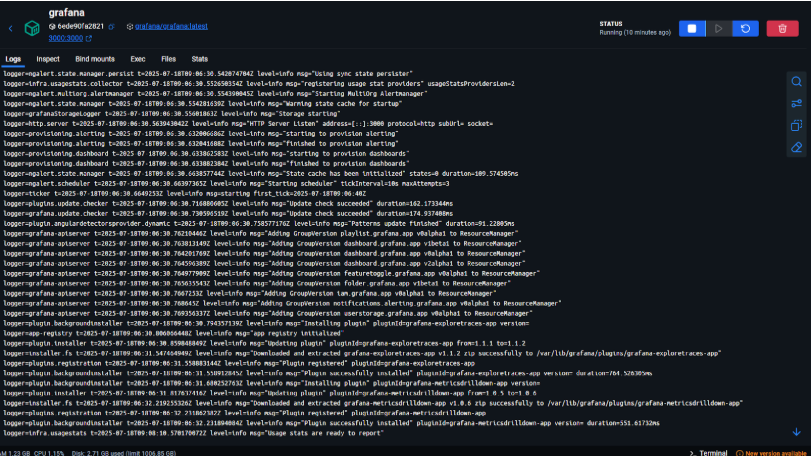

* Now, when creating a **new Dashboard** in Grafana, the data from the **mqtt-random-container** can be visualized in **Grafana**.

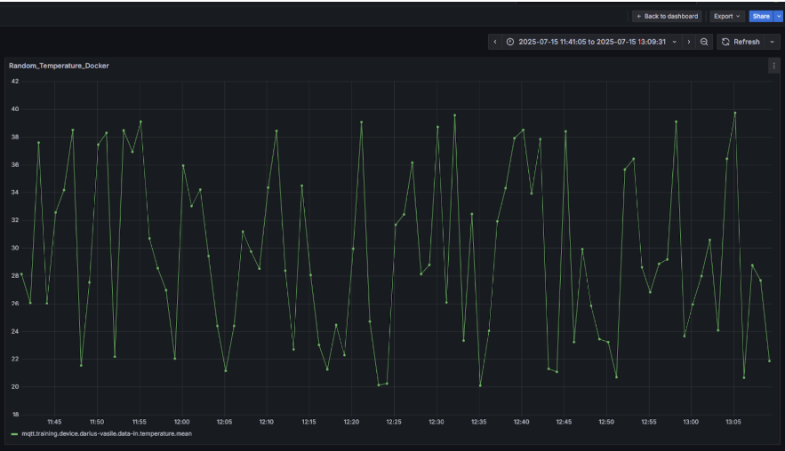

- In **Arrowhead**, created **documents** of the services, in order to be recognized:

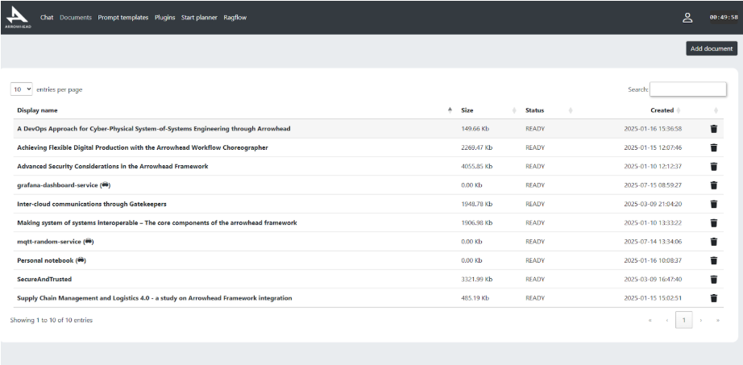

- Created a **Service Request** in the Chat, but received an error;

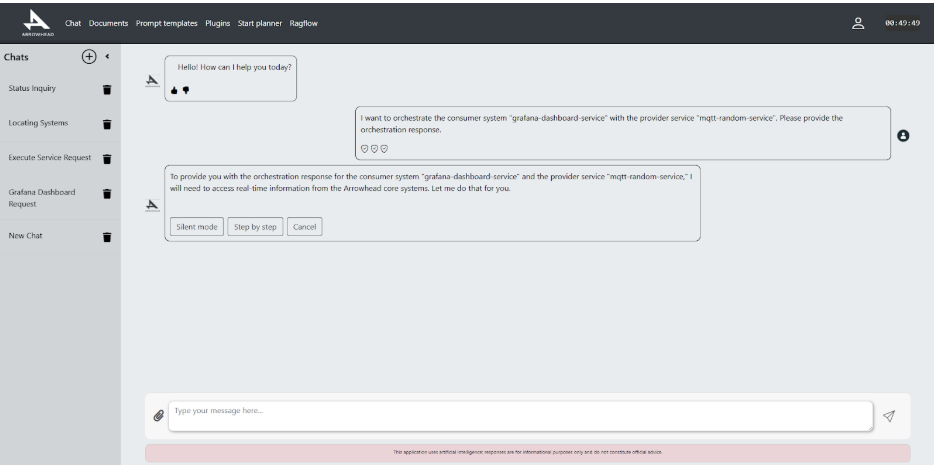

Conclusions:


The **3 Docker containers** have linked, even though they run separately. This happened **without Arrowhead**, because the 3 Docker Services were configured **manually**. There was no need for the Services to be discovered automatically.

Here is where **Arrowhead becomes useful**. It works very well when there are many services that need to be **orchestrated and managed automatically**, without human intervention.

--- 

## Mobile Application for Data Visualization and Automation

Application’s purpose:
* Displaying **real time data** from sensors and visualizing them in **graphs**;
* Managing **automations** from an environment (ex:turning on/off a water valve/smart light bulb/water pump);

Technologies Used:
* **Expo Go / React Native** - to create the mobile app;
* **Flask (Python)** - for local API;
* **Python Script** - for random data generation;

Steps of Implementation:
* Used the **mqtt_random.py** Script to generate random data, but added a **history JSON File** that saved the last **20 sensor values**, in order to place them in a graph;

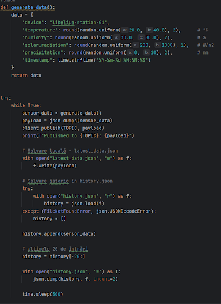

* Created a Flask API (**api_server.py**) in order to handle the **JSON Files** and **display** them in the app;

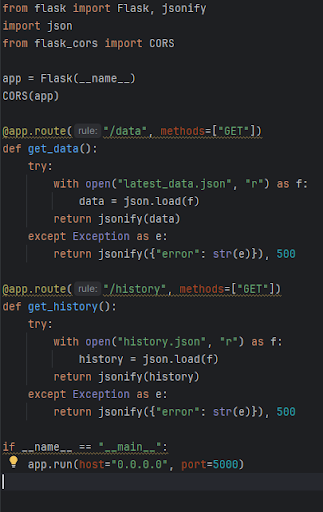

* In **Windows PowerShell**, created the **mqtt-sensor-classic folder** that holds the Project;


In Windows Powershell, used commands for page navigation in the app and temperature graph : 

* npx expo install @react-navigation/native
* npx expo install @react-navigation/native-stack
* npx expo install react-native-screens react-native-safe-area-context react-native-gesture-handler react-native-reanimated
* npx expo install react-native-chart-kit react-native-svg

To run the App, used the **npx expo start** command;

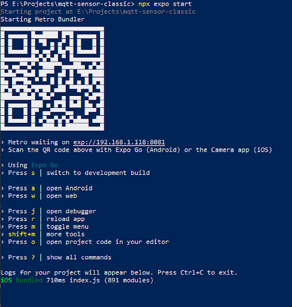

Created the 3 Pages of the App:

* **HomeScreen** - is the entry point of the App. It contains a Title, a custom background and 2 friendly buttons: one takes the user to the **SensorScreen** page, the other to the **AutomationScreen** page.

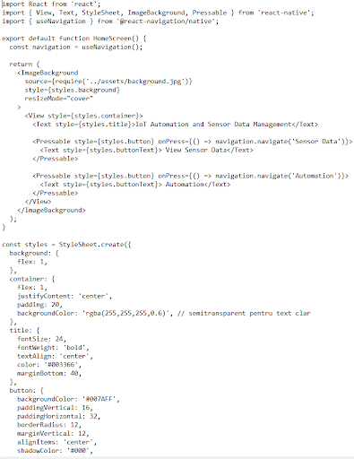

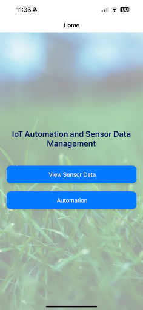


* **SensorScreen** - displays the data from the sensors in **real time** and a graph with the **last 20 temperature values**;

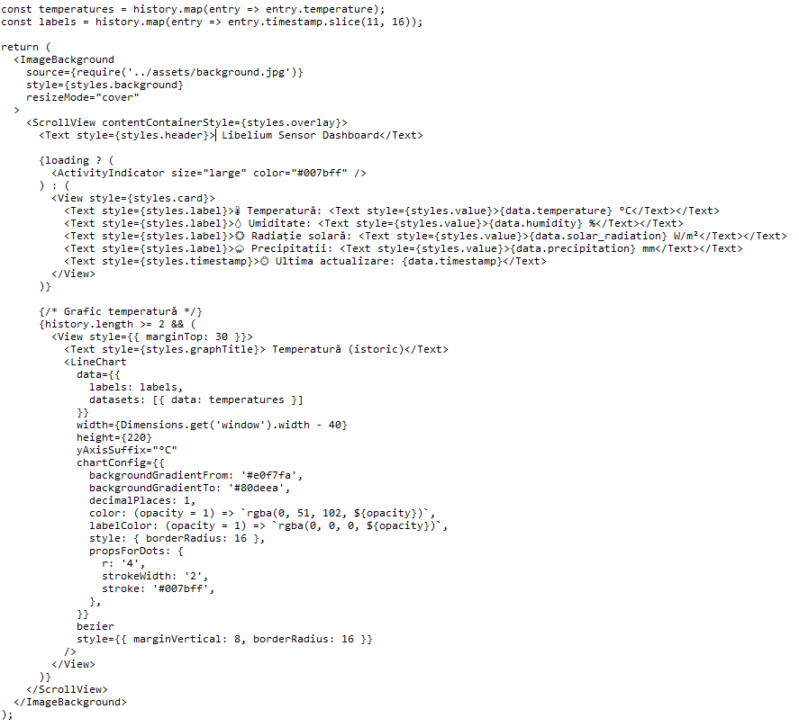

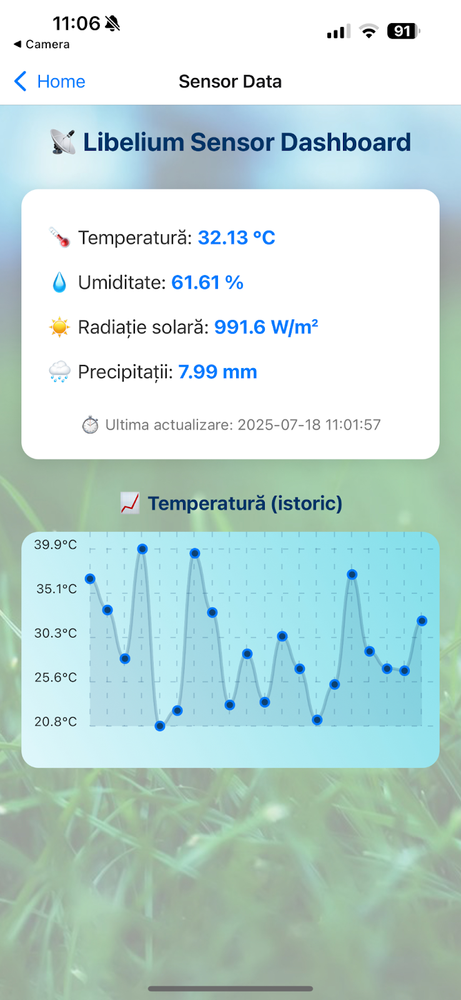

<p align="center">
  
</p>


* **AutomationScreen** - prepared for **future automation of IoT Devices**. For the moment, it contains 2 **ON/OFF Buttons** for a **Sonoff Smart Water Valve** and a **Smart Light Bulb**.

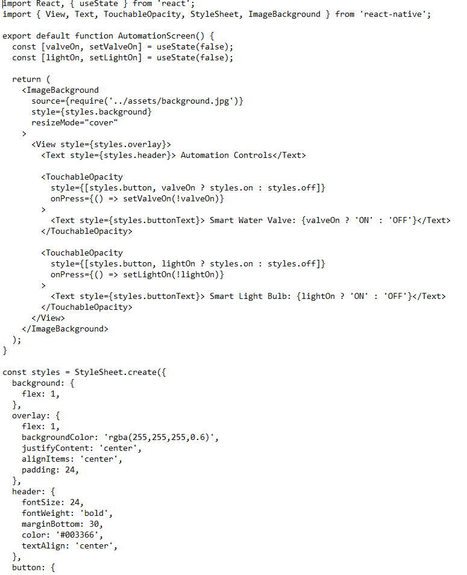

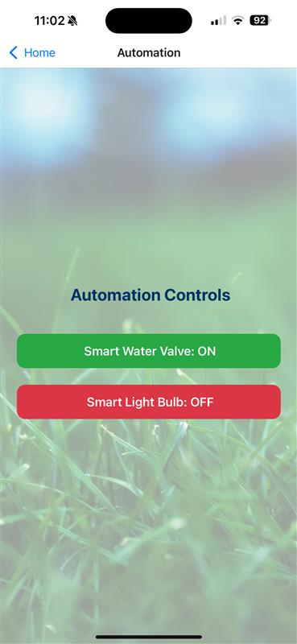

* In the **SensorScreen** page, added a **Box** that contains the **prediction for the next parameter values**. The prediction is **simple**, based on the mean of the difference between the **last 3 values of each parameter**.
* Also, added **graphs for all of the parameters**. Each graph can be accessed with a **Dropdown Button**.

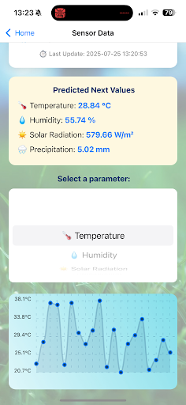


This mobile application demonstrates a simple, but effective way of **monitoring environmental sensor data in real time**. It uses simulated IoT data to display **temperature, humidity, solar radiation, and precipitation** through a **user-friendly dashboard** and a **live temperature chart**.

Although the automation controls are currently **visual-only** (with ON/OFF buttons), the application is structured in a **modular way** that allows for **future integration with real IoT devices**, MQTT-based actuation, voice commands, or cloud services.

 


## Project Structure

```bash
pre-practica-project/
│
├── code/                    
│   ├── mqtt_random.py
│   ├── mqtt_waspmote.py
│   ├── send_to_blockchain.py
│   └── darius_bot.py
│
├── photos/           
│
├── README.md
├── LICENSE
└── .gitignore
